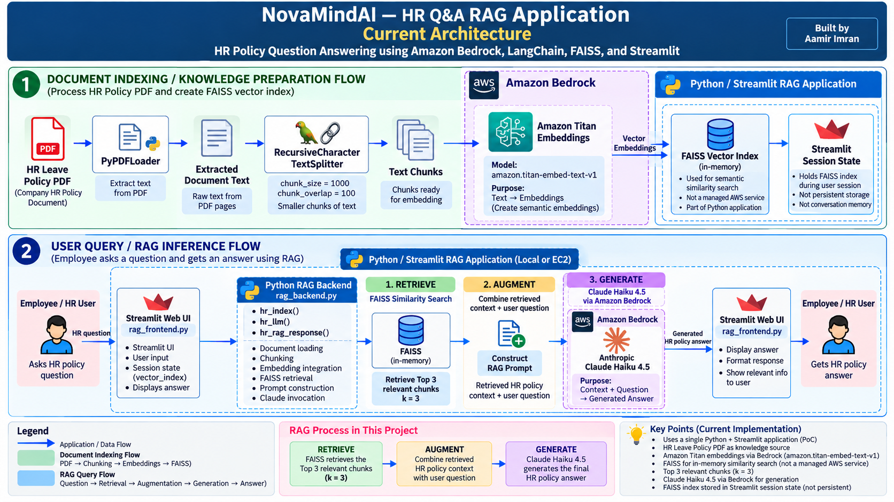
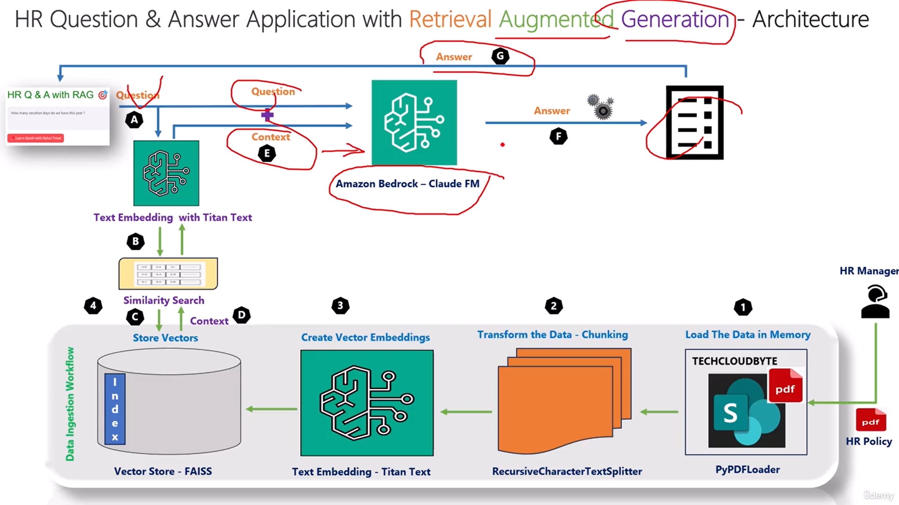

# 🧠 NovaMindAI — HR Q&A RAG Assistant

<p align="center">
  <strong>Retrieval-Augmented Generation (RAG) application for answering HR leave-policy questions using Amazon Bedrock, Titan Embeddings, Claude, FAISS, LangChain, and Streamlit.</strong>
</p>

<p align="center">
  
  
  
  
  
  
  
</p>

---

# 🧠 NovaMindAI — HR Q&A RAG Assistant

<p align="center">
  <strong>Retrieval-Augmented Generation (RAG) application for answering HR leave-policy questions using Amazon Bedrock, Titan Embeddings, Claude, FAISS, LangChain, and Streamlit.</strong>
</p>

<p align="center">
  
  
  
  
  
  
  
</p>

<!-- ====================================================== -->
<!-- PERSONAL BRANDING                                      -->
<!-- ====================================================== -->

<p align="center">
  <strong>Built & Engineered by Aamir Imran</strong>
</p>

<p align="center">
  <strong>AWS Generative AI Engineer | Agentic AI | RAG | MLOps | DevOps</strong>
</p>

<p align="center">
  Building production-oriented Generative AI, RAG, Agentic AI, and cloud-native AI applications on AWS.
</p>

<p align="center">
  <a href="https://github.com/aamir490">
    
  </a>
  <a href="https://linkedin.com/in/aamir-imran">
    
  </a>
</p>

<p align="center">
  <sub>
    Part of my hands-on AWS Generative AI & RAG engineering portfolio.
  </sub>
</p>

---

## 📌 Project Overview

**NovaMindAI HR Q&A** is a Retrieval-Augmented Generation (RAG) proof-of-concept application that allows employees to ask natural-language questions against an HR leave-policy document.

---
## 📌 Project Overview

**NovaMindAI HR Q&A** is a Retrieval-Augmented Generation (**RAG**) proof-of-concept application that allows employees to ask natural-language questions against an HR leave-policy document.

Instead of manually searching through a policy PDF, the application retrieves relevant policy information and provides it to an LLM as context before generating the final answer.

### 🎯 Problem

Employees may need to manually search lengthy HR policy documents to find information about:

- Leave eligibility
- Leave rules
- Carry-forward policies
- HR policy conditions
- Other leave-related information

### 💡 Solution

NovaMindAI converts the HR policy into searchable vector representations and uses semantic retrieval to find relevant policy sections before generating an answer.

```text
Employee Question
        ↓
Semantic Retrieval
        ↓
Relevant HR Policy Evidence
        ↓
Context + Question
        ↓
Claude
        ↓
Grounded HR Answer
```

---

# 🏗️ Architecture

<p align="center">
  
</p>

<p align="center">
  <em>Current implementation architecture — NovaMindAI HR Q&A RAG Application</em>
</p>

## 🔄 End-to-End RAG Flow

```text
HR Leave Policy PDF
        │
        ▼
PyPDFLoader
        │
        ▼
RecursiveCharacterTextSplitter
chunk_size = 1000
chunk_overlap = 100
        │
        ▼
Document Chunks
        │
        ▼
Amazon Titan Embeddings
via Amazon Bedrock
        │
        ▼
FAISS Vector Index
(In Memory)
        │
        │
        │       Employee Question
        │               │
        └───────────────▼
              Similarity Search
                   k = 3
                     │
                     ▼
          Top 3 Relevant Chunks
                     │
                     ▼
             Python Backend
          Build Context + Prompt
                     │
                     ▼
             Claude Haiku 4.5
          via Amazon Bedrock
                     │
                     ▼
              Generated Answer
                     │
                     ▼
               Streamlit UI
```

---

# 🧠 How RAG Works in This Project

The RAG pipeline is explicitly implemented in Python.

## 1️⃣ Retrieve

The employee's question is searched against the FAISS vector index.

```python
docs = index.similarity_search(question, k=3)
```

The application retrieves the **top 3 relevant HR policy chunks**.

---

## 2️⃣ Augment

The retrieved document text is combined into context.

```python
context = "\n\n".join([doc.page_content for doc in docs])
```

The backend then creates a prompt containing:

```text
Instruction
+
Retrieved HR Policy Context
+
Employee Question
```

---

## 3️⃣ Generate

The augmented prompt is sent to Claude through Amazon Bedrock.

```python
hr_rag_query = rag_llm.invoke(prompt)
```

The generated response is returned using:

```python
return hr_rag_query.content
```

### 🧠 Simple Mental Model

```text
Titan
  ↓
REPRESENTS

FAISS
  ↓
RETRIEVES

Python
  ↓
AUGMENTS

Claude
  ↓
GENERATES
```

> **Titan represents → FAISS retrieves → Python augments → Claude generates.**

---

# 🧰 Technology Stack

| Layer | Technology | Responsibility |
|---|---|---|
| Programming | Python 3.12 | Application and RAG logic |
| Frontend | Streamlit | Employee Q&A interface |
| AI Framework | LangChain | RAG components and integrations |
| Document Loader | PyPDFLoader | Loads HR policy PDF |
| Text Processing | RecursiveCharacterTextSplitter | Creates document chunks |
| Embeddings | Amazon Titan | Creates semantic vector representations |
| Vector Search | FAISS | Vector indexing and retrieval |
| LLM | Claude Haiku 4.5 | Generates final HR answers |
| AI Platform | Amazon Bedrock | Managed model access |
| Cloud | AWS | Cloud platform |

---

# ✨ Key Features

- 📄 HR leave-policy document processing
- ✂️ Recursive document chunking
- 🧠 Amazon Titan embeddings
- 🔎 Semantic vector search using FAISS
- 🎯 Top-3 relevant chunk retrieval
- 🤖 Claude-based answer generation
- 🔗 LangChain AWS integrations
- 🖥️ Streamlit user interface
- ♻️ Session-level FAISS index reuse
- ☁️ Amazon Bedrock integration
- 🧩 Explicit Retrieve → Augment → Generate workflow

---

# 🔗 LangChain's Role

LangChain is used as the **component and integration layer**.

```text
PyPDFLoader
      ↓
LOAD

RecursiveCharacterTextSplitter
      ↓
SPLIT

BedrockEmbeddings
      ↓
CONNECT TO TITAN

FAISS Integration
      ↓
INDEX + SEARCH

ChatBedrock
      ↓
CONNECT TO CLAUDE
```

LangChain does **not** automatically build the complete RAG workflow.

The Python backend explicitly orchestrates:

```text
Retrieve
   ↓
Augment
   ↓
Generate
```

> **LangChain provides reusable components and integrations, while the Python backend explicitly orchestrates the RAG workflow.**

---

# 📂 Project Structure

```text
.
├── rag_backend.py
├── rag_frontend.py
├── titien_model_test.py
├── data_load_test.py
├── data_split_test.py
├── Leave-Policy-India.pdf
├── project_Architecture.png
├── HR Question and Answer App with Rag.png
├── mylogo2.png
├── requirements.txt
├── interview.md
├── ec2_steps.txt
├── question_for_rag.txt
├── steps_to_do.md
└── README.md
```

---

# 🧩 Backend Design

The backend contains three main functions.

## `hr_index()`

Responsible for knowledge preparation:

```text
PDF
 ↓
Load
 ↓
Chunk
 ↓
Titan Embeddings
 ↓
FAISS Index
```

---

## `hr_llm()`

Configures the generation model:

```text
ChatBedrock
     ↓
Claude Haiku 4.5
     ↓
temperature = 0.1
max_tokens = 3000
```

---

## `hr_rag_response()`

Handles query-time RAG:

```text
Employee Question
       ↓
FAISS Similarity Search
       ↓
Top 3 Chunks
       ↓
Build Context
       ↓
Construct Prompt
       ↓
Claude
       ↓
Final Answer
```

---

# 🧠 FAISS Index & Session State

The application uses Streamlit session state:

```python
if 'vector_index' not in st.session_state:
    st.session_state.vector_index = demo.hr_index()
```

### First Session

```text
No Vector Index
      ↓
Load PDF
      ↓
Chunk
      ↓
Generate Embeddings
      ↓
Build FAISS
      ↓
Store in Session State
```

### Later Reruns in the Same Session

```text
Existing FAISS Index
       ↓
Reuse Index
       ↓
Search
       ↓
Generate Answer
```

> ⚠️ Streamlit session state is **not conversation memory** and is **not durable shared vector storage**.

---

# ☁️ Amazon Bedrock Integration

Amazon Bedrock is used for two different AI capabilities.

## Amazon Titan

Used for:

```text
Text
 ↓
Embedding
 ↓
Vector Representation
```

## Claude Haiku 4.5

Used for:

```text
Retrieved Context
+
Employee Question
        ↓
Claude
        ↓
Natural-Language Answer
```

### Important

```text
Titan  = Embeddings
FAISS  = Retrieval
Claude = Generation
```

---

# ⚙️ Local Setup

## 1️⃣ Clone the Repository

```bash
git clone https://github.com/aamir490/Use-Case--5--HR_Q_and_A_with_RAG_final.git

cd Use-Case--5--HR_Q_and_A_with_RAG_final
```

---

## 2️⃣ Create Python Virtual Environment

```powershell
py -3.12 -m venv .venv
```

Activate:

```powershell
.\.venv\Scripts\Activate.ps1
```

Verify:

```powershell
python --version
```

---

## 3️⃣ Install Dependencies

```bash
python -m pip install -r requirements.txt
```

---

# 🔐 Configure AWS Credentials

Configure the AWS CLI:

```bash
aws configure
```

Use:

```text
AWS Access Key ID: <YOUR_ACCESS_KEY_ID>
AWS Secret Access Key: <YOUR_SECRET_ACCESS_KEY>
Default region: us-east-1
Default output format: json
```

Verify authentication:

```bash
aws sts get-caller-identity
```

Verify configuration:

```bash
aws configure list
```

> ⚠️ **Security:** Never commit AWS Access Keys or Secret Access Keys to GitHub, source code, screenshots, documentation, or prompts.

---

# 🧪 Test Amazon Bedrock Integration

Before starting Streamlit:

```bash
python titien_model_test.py
```

This helps verify the AWS/Bedrock model integration before troubleshooting the frontend.

---

# ▶️ Run the Application

Start Streamlit:

```bash
streamlit run rag_frontend.py
```

Open:

```text
http://localhost:8501
```

---

# 🔐 AWS Authentication Design

The current implementation uses:

```python
credentials_profile_name="default"
```

for Bedrock integrations.

For a production AWS deployment, an appropriate **IAM role with least-privilege permissions** should be preferred over manually managed long-lived credentials.

---

# 🟢 Current Implementation

The following capabilities are part of the current project:

```text
✅ Python RAG backend
✅ Streamlit frontend
✅ PyPDFLoader
✅ RecursiveCharacterTextSplitter
✅ Amazon Titan embeddings
✅ Amazon Bedrock
✅ FAISS vector retrieval
✅ Claude generation
✅ LangChain integrations
✅ Top-3 similarity retrieval
✅ Manual prompt construction
✅ Streamlit session-state index reuse
```

---

# 🔴 Not Currently Implemented

The following technologies/features are **not part of the current implementation**:

```text
❌ Amazon Bedrock Knowledge Bases
❌ Amazon OpenSearch
❌ LangGraph
❌ AI Agents
❌ Multi-Agent Architecture
❌ Conversation Memory
❌ Persistent Shared Vector Index
❌ Authentication
❌ Role-Based Access Control
❌ User-Facing Source Citations
❌ Automated Policy Versioning
❌ Automated Production Ingestion Pipeline
```

---

# ⚠️ Current Limitations

This project is intentionally a **Proof of Concept (PoC)**.

Current limitations include:

- In-memory FAISS vector index
- Session-oriented index lifecycle
- Fixed remote HR policy source
- No persistent shared vector storage
- No conversation memory
- No authentication or RBAC
- No user-facing source citations
- No automated policy version management
- Limited error handling
- No systematic automated RAG evaluation
- No production observability pipeline

These limitations are intentionally documented rather than presenting the PoC as a production enterprise HR platform.

---

# 🚀 Production V2 Architecture

A production version could separate **knowledge ingestion** from **query serving**.

```text
                 KNOWLEDGE INGESTION

Approved HR Policies
        ↓
Source Validation
        ↓
Policy Versioning
        ↓
Document Processing
        ↓
Chunking
        ↓
Titan Embeddings
        ↓
Persistent Shared Vector Index


                   QUERY SERVING

Authenticated Employee
        ↓
Natural-Language Question
        ↓
Vector Retrieval
        ↓
Relevant Policy Evidence
        ↓
Context + Question
        ↓
Claude
        ↓
Grounded Answer
        ↓
Source Citations
```

## Potential Production Improvements

- 🔐 Authentication and authorization
- 👥 Role-based access control
- 📄 Controlled document ingestion
- 🔄 Policy version management
- 🗂️ Persistent shared vector retrieval
- 🔗 Source citations
- 🛡️ Stronger grounding rules
- 🚫 Explicit abstention for unsupported questions
- 🧪 RAG evaluation dataset
- 📊 Retrieval-quality monitoring
- 📈 Application observability
- ⚠️ Error handling
- 🔑 IAM roles and least-privilege permissions
- 📦 Separate ingestion and query-serving workflows

---

# 🧪 RAG Evaluation Strategy

A production RAG system should evaluate retrieval and generation separately.

## Retrieval Evaluation

```text
HR Question
     ↓
Expected Policy Evidence
     ↓
FAISS Retrieval
     ↓
Was the correct evidence retrieved?
```

Evaluate:

- Top-k retrieval quality
- Relevant policy-section retrieval
- Chunking quality
- Embedding effectiveness

## Generation Evaluation

Evaluate whether the answer is:

- Grounded in retrieved context
- Consistent with the HR policy
- Relevant to the employee question
- Able to abstain when evidence is insufficient

---

# 🔍 Troubleshooting Strategy

If the application produces an incorrect answer:

```text
Wrong Answer
     ↓
Inspect Retrieved Chunks
     ↓
┌───────────────────────┐
│ Correct Evidence?     │
└───────────────────────┘
     │             │
    NO            YES
     │             │
     ▼             ▼
Retrieval       Generation
Problem         Problem
     │             │
     ▼             ▼
Check:          Check:
Source          Prompt
Extraction      Context
Chunking        Instructions
Embeddings      Model behavior
FAISS
k value
```

> **Do not automatically blame the LLM for every RAG failure.**

---

# 🎯 Interview Explanation

> **“NovaMindAI HR Q&A is a RAG-based proof of concept that allows employees to ask natural-language questions against an HR leave-policy document.**
>
> **The policy is loaded using PyPDFLoader and split using RecursiveCharacterTextSplitter with a chunk size of 1000 and overlap of 100. Amazon Titan through Bedrock provides embeddings, while FAISS provides vector retrieval.**
>
> **When an employee asks a question, the application retrieves the top three relevant policy chunks. My Python backend joins those chunks into context, constructs an augmented prompt containing the policy context and question, and invokes Claude Haiku 4.5 through Amazon Bedrock.**
>
> **LangChain provides reusable components and integrations, while the retrieve, augment and generate workflow is explicitly orchestrated in Python.**
>
> **The current implementation is a proof of concept. For production, I would improve the architecture with controlled policy ingestion and versioning, shared persistent retrieval, authentication and authorization, citations, stronger grounding, observability and systematic RAG evaluation.”**

---

# 🧠 Project Mental Model

```text
                     HR POLICY
                         │
                         ▼
                  PyPDFLoader
                         │
                         ▼
                      CHUNKS
                         │
                         ▼
                       TITAN
                         │
                         ▼
                      VECTORS
                         │
                         ▼
                       FAISS
                         ▲
                         │
Employee Question ───────┘
        │
        ▼
  Similarity Search
       k = 3
        │
        ▼
Top 3 Relevant Chunks
        │
        ▼
  Python Augmentation
        │
        ▼
 Context + Question
        │
        ▼
      CLAUDE
        │
        ▼
    HR ANSWER
        │
        ▼
    STREAMLIT
```

---

# 💡 Key Learning

```text
Titan
   =
Creates semantic representations

FAISS
   =
Retrieves relevant policy knowledge

Python
   =
Orchestrates and augments the RAG workflow

Claude
   =
Generates the final answer

LangChain
   =
Provides reusable components and integrations

Amazon Bedrock
   =
Provides managed access to Titan and Claude

Streamlit
   =
Provides the user interface
```

---

# 👨‍💻 Author

## Aamir Imran

**AWS Generative AI Engineer | Agentic AI | RAG | MLOps | DevOps**

<p>
  <a href="https://github.com/aamir490">
    
  </a>
  <a href="https://linkedin.com/in/aamir-imran">
    
  </a>
</p>

---

<p align="center">
  <strong>Built by Aamir Imran</strong>
</p>

<p align="center">
  <strong>⭐ If you find this project useful, consider starring the repository.</strong>
</p>


<!-- Yes. I reviewed the uploaded Markdown. Right now it reads more like a **setup/runbook (`steps_to_do.md`)** than a strong GitHub landing-page README. It correctly identifies the project as a RAG PoC using Streamlit, Bedrock/LangChain, PDF processing, FAISS, and AWS. :chatgpt-content-reference{index="0"} It also contains a long Windows/Python/AWS setup and troubleshooting guide, which is useful but too detailed for the main README. :chatgpt-content-reference{index="1"}

I would turn it into a **professional portfolio README**, especially because you want recruiters/interviewers to understand the project quickly.

### What I would change

At the top, add a strong project title, one-line description, GitHub shields/badges, architecture image, and a concise technology stack. Then organize it around **Problem → Solution → Architecture → RAG Flow → Features → Tech Stack → Code Structure → Setup → Run → Limitations → Production V2 → Interview explanation**.

For example, the header could look like this:

```markdown
# 🧠 NovaMindAI — HR Q&A RAG Assistant

<p align="center">
  <strong>Retrieval-Augmented Generation (RAG) application for answering HR leave-policy questions using Amazon Bedrock, Titan Embeddings, Claude, FAISS, LangChain, and Streamlit.</strong>
</p>

<p align="center">


</p>

---

## 📌 Project Overview

**NovaMindAI HR Q&A** is a Retrieval-Augmented Generation (RAG) proof of concept that allows employees to ask natural-language questions against an HR leave-policy document.

Instead of manually searching through a policy PDF, the application:

1. Loads the HR policy document
2. Splits it into smaller chunks
3. Generates embeddings using Amazon Titan through Amazon Bedrock
4. Stores the vectors in an in-memory FAISS index
5. Retrieves the top 3 relevant chunks for each question
6. Builds a grounded prompt using the retrieved policy context
7. Sends the prompt to Claude through Amazon Bedrock
8. Displays the generated answer through Streamlit

---

## 🏗️ Architecture

<p align="center">
  
</p>

### High-Level Flow

```text
HR Leave Policy PDF
        │
        ▼
PyPDFLoader
        │
        ▼
RecursiveCharacterTextSplitter
chunk_size = 1000
chunk_overlap = 100
        │
        ▼
Amazon Titan Embeddings
        │
        ▼
FAISS Vector Index
        │
        │
Employee Question
        │
        ▼
FAISS Similarity Search
k = 3
        │
        ▼
Top 3 Relevant Policy Chunks
        │
        ▼
Python Context + Prompt Construction
        │
        ▼
Claude Haiku 4.5
Amazon Bedrock
        │
        ▼
Generated HR Answer
        │
        ▼
Streamlit UI
```

---

## 🔄 How RAG Works in This Project

The RAG pipeline is explicitly implemented in Python:

### 1. Retrieve

```python
docs = index.similarity_search(question, k=3)
```

FAISS retrieves the top three policy chunks relevant to the employee's question.

### 2. Augment

```python
context = "\n\n".join([doc.page_content for doc in docs])
```

The retrieved chunks are combined with the employee's question.

### 3. Generate

```python
hr_rag_query = rag_llm.invoke(prompt)
```

Claude receives the retrieved HR-policy context and generates the final response.

> **Mental Model:**  
> Titan represents → FAISS retrieves → Python augments → Claude generates.

---

## 🧰 Technology Stack

| Layer | Technology | Responsibility |
|---|---|---|
| Language | Python 3.12 | Application logic |
| Frontend | Streamlit | Employee Q&A interface |
| Framework | LangChain | RAG components and integrations |
| Document Loader | PyPDFLoader | Loads HR policy PDF |
| Text Processing | RecursiveCharacterTextSplitter | Creates document chunks |
| Embeddings | Amazon Titan | Creates semantic vectors |
| Vector Search | FAISS | Vector indexing and retrieval |
| LLM | Claude Haiku 4.5 | Generates answers |
| AI Platform | Amazon Bedrock | Managed model access |
| Cloud | AWS | Cloud platform |

---

## ✨ Key Features

- 📄 HR policy document ingestion
- ✂️ Recursive document chunking
- 🧠 Amazon Titan embeddings
- 🔎 Semantic search using FAISS
- 🎯 Top-3 relevant chunk retrieval
- 🤖 Claude-based answer generation
- 🔗 LangChain AWS integrations
- 🖥️ Streamlit user interface
- ♻️ FAISS index reuse through Streamlit session state
- ☁️ Amazon Bedrock integration

---

## 🧩 LangChain's Role

LangChain provides reusable components and integrations used by the application:

```text
PyPDFLoader
        ↓
RecursiveCharacterTextSplitter
        ↓
BedrockEmbeddings
        ↓
FAISS Integration
        ↓
ChatBedrock
```

LangChain does **not** automatically build the complete RAG workflow.

The Python backend explicitly orchestrates:

```text
Retrieve → Augment → Generate
```

---

## 📂 Project Structure

```text
.
├── rag_backend.py
├── rag_frontend.py
├── titien_model_test.py
├── data_load_test.py
├── data_split_test.py
├── Leave-Policy-India.pdf
├── project_Architecture.png
├── requirements.txt
├── interview.md
├── ec2_steps.txt
└── README.md
```

---

## ⚙️ Local Setup

### Clone the repository

```bash
git clone https://github.com/aamir490/Use-Case--5--HR_Q_and_A_with_RAG_final.git
cd Use-Case--5--HR_Q_and_A_with_RAG_final
```

### Create a virtual environment

```powershell
py -3.12 -m venv .venv
.\.venv\Scripts\Activate.ps1
```

### Install dependencies

```bash
python -m pip install -r requirements.txt
```

### Configure AWS

```bash
aws configure
```

Verify:

```bash
aws sts get-caller-identity
```

> ⚠️ Never commit AWS access keys or secret keys to GitHub.

---

## ▶️ Run the Application

Test the Bedrock integration:

```bash
python titien_model_test.py
```

Start Streamlit:

```bash
streamlit run rag_frontend.py
```

Then open:

```text
http://localhost:8501
```

---

## 🔐 AWS Authentication

The current implementation uses:

```python
credentials_profile_name="default"
```

for the Bedrock integrations.

For a production AWS deployment, an appropriate IAM role with least-privilege permissions should be preferred over long-lived application credentials.

---

## 🧠 Current Design

### Implemented

- Manual RAG pipeline
- PDF loading
- Recursive chunking
- Titan embeddings
- FAISS similarity search
- Claude generation
- Streamlit frontend
- Session-level FAISS reuse

### Not Implemented

- ❌ Bedrock Knowledge Bases
- ❌ OpenSearch
- ❌ LangGraph
- ❌ AI agents
- ❌ Conversation memory
- ❌ Persistent shared vector index
- ❌ Authentication / RBAC
- ❌ User-facing source citations
- ❌ Automated policy-versioning pipeline

---

## ⚠️ Current Limitations

This project is intentionally a **Proof of Concept**.

The current architecture uses an in-memory FAISS index and a fixed policy source. The project does not currently provide a production authentication layer, durable shared vector storage, conversation memory, user-facing citations, automated policy lifecycle management, or systematic RAG evaluation.

---

## 🚀 Production V2

A production architecture could evolve toward:

```text
Approved HR Policies
        ↓
Controlled Ingestion
        ↓
Validation + Versioning
        ↓
Chunking
        ↓
Embeddings
        ↓
Persistent Shared Vector Index
        │
        ▼
Authenticated Employee
        ↓
Question
        ↓
Vector Retrieval
        ↓
Grounded Context
        ↓
Claude
        ↓
Answer + Source Citations
```

Potential improvements:

- Authentication and authorization
- Controlled document ingestion
- Policy versioning
- Persistent/shared vector retrieval
- Source citations
- Stronger grounding and abstention rules
- RAG evaluation dataset
- Retrieval-quality monitoring
- Error handling and observability
- Production IAM roles

---

## 🎯 Interview Explanation

> **“NovaMindAI HR Q&A is a RAG-based proof of concept that allows employees to ask natural-language questions against an HR leave-policy document. The policy is loaded and chunked using LangChain components, Amazon Titan through Bedrock generates embeddings, and FAISS provides vector retrieval. For each employee question, the application retrieves the top three relevant policy chunks, constructs a context-grounded prompt and invokes Claude Haiku 4.5 through Amazon Bedrock. LangChain provides the integrations, while the retrieve, augment and generate workflow is explicitly orchestrated in Python.”**

---

## 🗺️ RAG Mental Model

```text
                    HR POLICY
                        │
                        ▼
                 Load + Chunk
                        │
                        ▼
               Titan Embeddings
                        │
                        ▼
                      FAISS
                        ▲
                        │
Employee Question ──────┘
        │
        ▼
 Top 3 Relevant Chunks
        │
        ▼
 Context + Question
        │
        ▼
      Claude
        │
        ▼
   HR Answer
```

---

## 👨‍💻 Author

**Aamir Imran**

AWS Generative AI Engineer | Agentic AI | RAG | MLOps | DevOps

- GitHub: [aamir490](https://github.com/aamir490)
- LinkedIn: [Aamir Imran](https://linkedin.com/in/aamir-imran)

---

<p align="center">
  <strong>Built by Aamir Imran</strong>
</p>

<p align="center">
  ⭐ If you find this project useful, consider starring the repository.
</p>
```

This would be a **much stronger GitHub README** than keeping all 17 setup/troubleshooting steps on the landing page. Your existing detailed commands—Python version checks, process/PID handling, port `8501` troubleshooting, background Streamlit startup, etc.—are useful documentation, but I'd move them into something like **`docs/SETUP.md` or `steps_to_do.md`**. Your current file already contains a large amount of that operational material. :chatgpt-content-reference{index="2"}

One other important improvement: your current package section lists packages such as `transformers`, `PyYAML`, and `flask-sqlalchemy` as part of the installation set. :chatgpt-content-reference{index="3"} I would **not advertise every installed package as part of the main technology stack** unless the actual application code uses it. The README should describe the implementation, not simply everything present in the environment.

And yes—the **badges/shields are worth adding**. For your portfolio, I'd keep them focused: **Python, AWS/Bedrock, LangChain, Streamlit, FAISS, RAG, PoC status**, rather than filling the page with 20 badges.

<!-- # 🚀 HR QA Project — `steps_to_do.md`

> **Project Name:** HR QA  
> **Project Type:** Proof of Concept (PoC) — Retrieval-Augmented Generation (RAG) / Generative AI application  
> **Frontend:** Streamlit  
> **AI / LLM Integration:** Amazon Bedrock + LangChain  
> **Document Processing:** PyPDF + LangChain Text Splitters  
> **Vector Store:** FAISS  
> **Cloud:** AWS  
> **AWS Region:** `us-east-1`

---

# 🏗️ Basic Architecture

```text
👤 User
   │
   ▼
🖥️ Streamlit Frontend
   │
   ▼
🧠 RAG Application
   │
   ├── 📄 PDF / Document Processing
   │      ├── PyPDF
   │      └── LangChain Text Splitters
   │
   ├── 🔎 FAISS Vector Store
   │      └── Similarity Search / Retrieval
   │
   ├── 🔗 LangChain
   │
   └── ☁️ Amazon Bedrock
          └── Foundation Model / LLM
   │
   ▼
🤖 Generated HR Answer
   │
   ▼
🖥️ Streamlit UI
```

### 🔄 Basic Application Flow

```text
📄 HR Documents
      ↓
📖 Load Documents
      ↓
✂️ Split Documents into Chunks
      ↓
🔢 Create / Use Embeddings
      ↓
🗂️ Store / Search Vectors using FAISS
      ↓
🔎 Retrieve Relevant Context
      ↓
🧠 Send Context + Question to Amazon Bedrock
      ↓
🤖 Generate Answer
      ↓
🖥️ Display Answer in Streamlit
```

---

# 🟢 STEP 1: Navigate to the Project Directory

```powershell
# ==========================================================
# Step 1: Navigate to the Project Directory
# ==========================================================

# Display the current directory
Get-Location

# Copy the project's relative path and change to that directory
cd "E:\GenAi-Project-Udemy\HR_QA_26June2025\HR_QA_26June2025"

# Verify you are in the correct folder
pwd

# See all files
dir
```

### 💡 Comment

- Make sure the terminal is inside the correct **HR_QA_26June2025** project directory before continuing.
- `Get-Location` and `pwd` help confirm the current working directory.
- `dir` displays the project files and folders.

---

# 🟢 STEP 2: Check Python Versions

```powershell
# ==========================================================
# Step 2: Create a Python Virtual Environment
# ==========================================================

# Create a virtual environment named '.venv'

# Check current base core versions
python --version
py --version
```

Expected environment:

```text
python --version
Python 3.12.0

py --version
Python 3.14.6
```

### ⚠️ NOTE

This means `python` and `py` are pointing to different Python installations.

### ✅ NOTE

For this Kiro project, use **Python 3.12**.

---

## 🔎 Check All Installed Python Versions

Open **Command Prompt or AWS Kiro PowerShell**.

```powershell
py -0
py --list
```

Expected:

```text
-V:3.14 *        Python 3.14 (64-bit)
-V:3.12          Python 3.12 (64-bit)
```

### 💡 Comment

The `*` indicates the current default Python version for the `py` launcher.

Even though Python 3.14 is the default for `py`, this project will explicitly use Python 3.12.

---

# 🟢 STEP 3: Create the Virtual Environment

## ✅ Create `.venv` with Python 3.12

```powershell
py -3.12 -m venv .venv
```

Activate the environment:

```powershell
.\.venv\Scripts\Activate.ps1
```

Expected prompt:

```text
(.venv) PS E:\GenAi-Project-Udemy\HR_QA_26June2025\HR_QA_26June2025>
```

---

## 🔎 Confirm Python 3.12

```powershell
py -3.12 --version
```

## 🔎 Confirm pip is working under Python 3.12

```powershell
py -3.12 -m pip --version
```

### Optional — Upgrade pip

```powershell
python -m pip install --upgrade pip
```

---

## 🔎 Confirm the Activated `.venv`

```powershell
python --version
```

Expected:

```text
Python 3.12.0
```

### Optional — Run a specific Python version

```powershell
py -3.12
```

---

# 🟢 STEP 4: Configure AWS Credentials

```powershell
# ==========================================================
# Step 4: Configure AWS Credentials
# ==========================================================

# Run the AWS configuration wizard
aws configure
```

When prompted, provide your AWS credentials.

> ⚠️ **Security Note:** Do NOT store real AWS Access Keys or Secret Access Keys inside this Markdown file, Git repository, screenshots, prompts, or project documentation. The credentials that were present in the original notes have intentionally been redacted here. If those credentials were real and have been exposed/shared, rotate or deactivate them immediately and create new credentials.

Use:

```text
AWS Access Key ID [None]: <YOUR_ACCESS_KEY_ID>
AWS Secret Access Key [None]: <YOUR_SECRET_ACCESS_KEY>
Default region name [None]: us-east-1
Default output format [None]: json
```

---

# 🟢 STEP 5: Verify AWS Configuration

```powershell
# ==========================================================
# Step 5: Verify AWS Configuration
# ==========================================================

# Run this command to verify who you are logged in as
aws sts get-caller-identity

# The Resource Test (List S3 Buckets)
aws s3 ls

# This shows your default profile — name, key, region, etc.
aws configure list

# To see all profiles you have configured
aws configure list-profiles

# To verify the default profile has the right credentials and region
aws configure list --profile default

# And to confirm it can actually connect to AWS
aws sts get-caller-identity --profile default
```

### ✅ Expected Result

`aws sts get-caller-identity` should return your AWS account / identity information without an authentication error.

---

# 🟢 STEP 6: HR QA Project — Additional Package Installation

```powershell
# ==========================================================
# HR QA Project — Additional Package Installation
# ==========================================================

# Install the required libraries
python -m pip install boto3 langchain langchain-aws langchain-community langchain-text-splitters streamlit transformers PyYAML pypdf faiss-cpu flask-sqlalchemy
```

### 📦 Main Libraries

- `boto3` → AWS SDK for Python
- `langchain` → LLM / RAG application framework
- `langchain-aws` → AWS integrations for LangChain
- `langchain-community` → Community integrations
- `langchain-text-splitters` → Document chunking
- `streamlit` → Web application frontend
- `transformers` → Hugging Face transformer ecosystem
- `PyYAML` → YAML configuration support
- `pypdf` → PDF processing
- `faiss-cpu` → Vector similarity search
- `flask-sqlalchemy` → Flask / SQLAlchemy integration

---

# 🟢 STEP 7: Create and Verify `requirements.txt`

```powershell
# Create requirements.txt from the current environment
python -m pip freeze > requirements.txt
```

### 🔎 Check whether the file was created

```powershell
dir requirements.txt
```

or:

```powershell
Get-Item requirements.txt
```

### 📖 View the contents

```powershell
Get-Content requirements.txt
```

### 📦 Install from `requirements.txt`

```powershell
python -m pip install -r requirements.txt
```

### 💡 Comment

`requirements.txt` records the installed Python packages and versions so the environment can be recreated later.

---

# 🟢 STEP 8: Before Starting Streamlit — Test the Model

```powershell
# ==========================================================
# Step 8: Before Start Streamlit Application Test Model
# ==========================================================

python titien_model_test.py
```

### 🔎 Comment

Run this test before starting the frontend.

The purpose is to verify that the model / AWS integration is working before troubleshooting the Streamlit application.

---

# 🟢 STEP 9: Run the Streamlit Application

```powershell
# ==========================================================
# Step 9: Run the Streamlit Application
# ==========================================================

# Start the Streamlit server
streamlit run rag_frontend.py
```

### 🌐 Typical Streamlit Address

```text
http://localhost:8501
```

or:

```text
http://127.0.0.1:8501
```

---

# 🟢 STEP 10: Run Streamlit in the Background

If you want to keep using the Kiro PowerShell terminal after starting Streamlit, run:

```powershell
Start-Process -FilePath "python" -ArgumentList "-m streamlit run rag_frontend.py --server.address 0.0.0.0 --server.port 8501" -WindowStyle Hidden
```

### 💡 Comment

This starts the Streamlit application as a background process so the current PowerShell terminal remains available for other commands.

---

# 🟢 STEP 11: Check Whether Streamlit Is Running

## 🔎 Option A — Check the Streamlit Process

```powershell
Get-Process python
```

For more detail:

```powershell
Get-Process python | Select-Object Id, ProcessName, StartTime
```

### 🔎 Search specifically for Streamlit

```powershell
Get-CimInstance Win32_Process -Filter "Name = 'python.exe'" |
Where-Object { $_.CommandLine -like "*streamlit*" } |
Select-Object ProcessId, CommandLine
```

This is useful because it shows the **PID** and the command that started Streamlit.

---

# 🟢 STEP 12: Check Which Process Is Using Port 8501

```powershell
Get-NetTCPConnection -LocalPort 8501 -ErrorAction SilentlyContinue
```

Or:

```powershell
netstat -ano | findstr :8501
```

Example:

```text
TCP    0.0.0.0:8501    0.0.0.0:0    LISTENING    12345
```

Here:

```text
12345 = PID
```

---

# 🟢 STEP 13: Find the Process from the PID

If the PID is `12345`:

```powershell
Get-Process -Id 12345
```

Or:

```powershell
tasklist /FI "PID eq 12345"
```

### 💡 Comment

This helps confirm which application currently owns port `8501`.

---

# 🟢 STEP 14: Stop / Kill the Streamlit Process

## Option A — Stop using PID

If the PID is `12345`:

```powershell
Stop-Process -Id 12345 -Force
```

## Option B — Using `taskkill`

```powershell
taskkill /PID 12345 /F
```

## Option C — Find Streamlit Python process and stop it

```powershell
Get-CimInstance Win32_Process -Filter "Name = 'python.exe'" |
Where-Object { $_.CommandLine -like "*streamlit*" } |
ForEach-Object { Stop-Process -Id $_.ProcessId -Force }
```

### ⚠️ Important

Only use the last command when you are sure the matching Python process belongs to your Streamlit application.

---

# 🟢 STEP 15: Verify Port 8501 Is Free

After killing the process:

```powershell
Get-NetTCPConnection -LocalPort 8501 -ErrorAction SilentlyContinue
```

or:

```powershell
netstat -ano | findstr :8501
```

If nothing is returned, port `8501` is free.

You can then start Streamlit again.

---

# 🟢 STEP 16: Maintenance, Controls & Troubleshooting Reference

## 🛑 Stop a Foreground Streamlit Application

If Streamlit is running directly in the current terminal:

```text
Ctrl + C
```

---

## 🧹 Clear PowerShell Screen

```powershell
Clear-Host
```

or:

```powershell
clear
```

---

## 🔎 Check Python

```powershell
python --version
```

---

## 🔎 Check pip

```powershell
python -m pip --version
```

---

## 📦 Check Installed Packages

```powershell
pip list
```

or:

```powershell
python -m pip list
```

---

# 🟢 STEP 17: How to Run / Install `requirements.txt` on a Fresh Setup

If moving to a new machine or setting up a fresh environment later:

### 1️⃣ Navigate to the folder

```powershell
cd "E:\GenAi-Project-Udemy\Code_15042025\Code_15042025"
```

### 2️⃣ Activate the environment

```powershell
.\.venv\Scripts\Activate.ps1
```

### 3️⃣ Run the installer

```powershell
pip install -r requirements.txt
```

### 4️⃣ Verify the packages

```powershell
pip list
```

### ✅ Recommended Alternative

```powershell
python -m pip install -r requirements.txt
```

Using `python -m pip` helps ensure that packages are installed into the Python environment currently being used by the project.

---

# 🏁 QUICK START — EXISTING PROJECT

When the project is already configured and `.venv` exists:

```powershell
cd "E:\GenAi-Project-Udemy\HR_QA_26June2025\HR_QA_26June2025"

.\.venv\Scripts\Activate.ps1

python --version

python -m pip --version

python titien_model_test.py

Start-Process -FilePath "python" -ArgumentList "-m streamlit run rag_frontend.py --server.address 0.0.0.0 --server.port 8501" -WindowStyle Hidden

netstat -ano | findstr :8501
```

Then open:

```text
http://localhost:8501
```

---

# 🔁 QUICK STOP / RESTART

### 🛑 Find Streamlit

```powershell
Get-CimInstance Win32_Process -Filter "Name = 'python.exe'" |
Where-Object { $_.CommandLine -like "*streamlit*" } |
Select-Object ProcessId, CommandLine
```

### 🛑 Kill Streamlit

```powershell
Stop-Process -Id <PID> -Force
```

### 🚀 Start Again

```powershell
Start-Process -FilePath "python" -ArgumentList "-m streamlit run rag_frontend.py --server.address 0.0.0.0 --server.port 8501" -WindowStyle Hidden
```

### 🔎 Confirm Port

```powershell
netstat -ano | findstr :8501
```

---

# 🎯 FINAL PROJECT FLOW

```text
👤 User
   ↓
🖥️ Streamlit — rag_frontend.py
   ↓
🧠 RAG Pipeline
   ↓
📄 PDF Processing — PyPDF
   ↓
✂️ Text Splitting — LangChain
   ↓
🔎 Vector Retrieval — FAISS
   ↓
🔗 LangChain
   ↓
☁️ Amazon Bedrock
   ↓
🤖 AI / HR Answer
   ↓
🖥️ Streamlit UI
```

> 🔥 **Project Goal:** Build and run an HR Question-Answering Proof of Concept using a Retrieval-Augmented Generation (RAG) architecture with LangChain, FAISS, Streamlit, and Amazon Bedrock. --> -->
